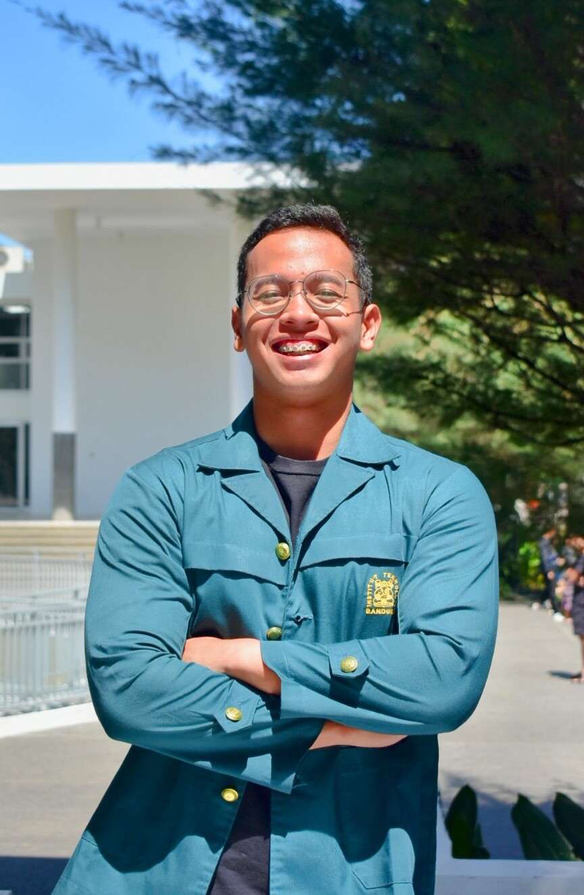
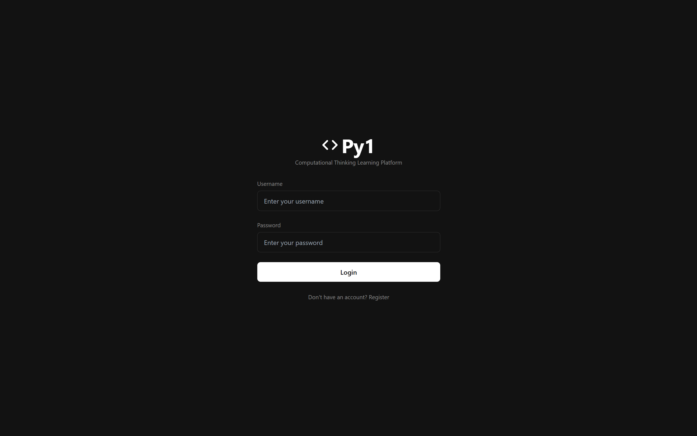
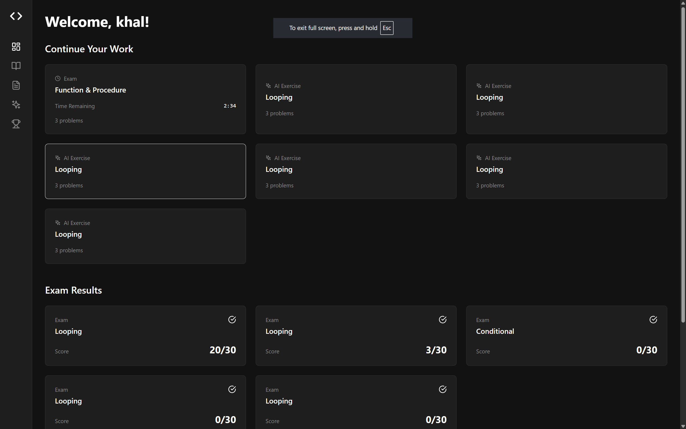
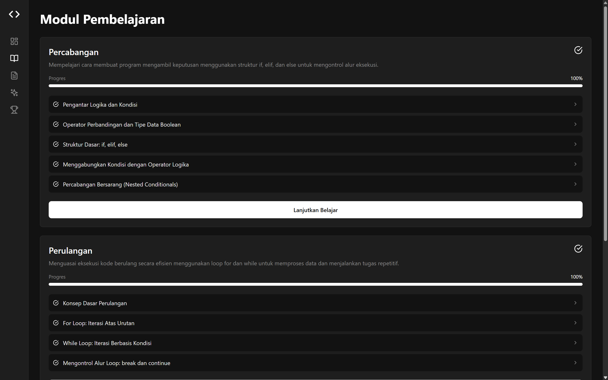
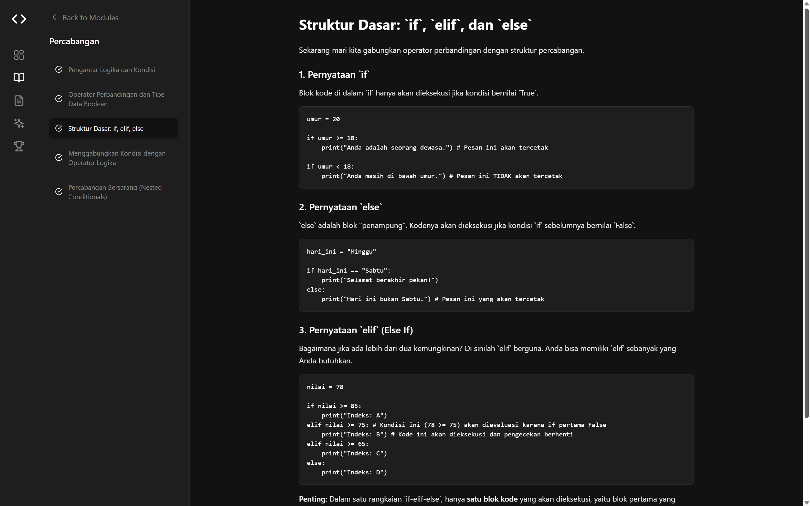
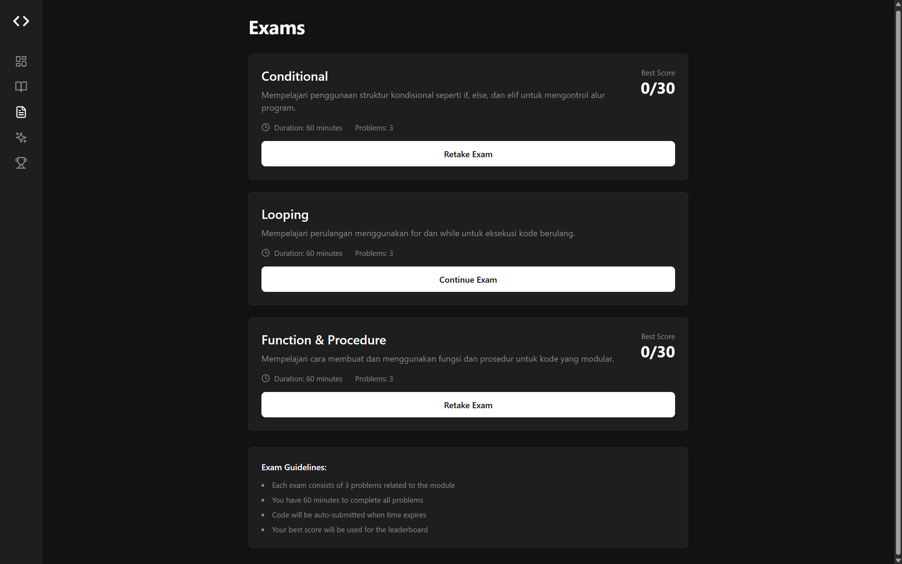
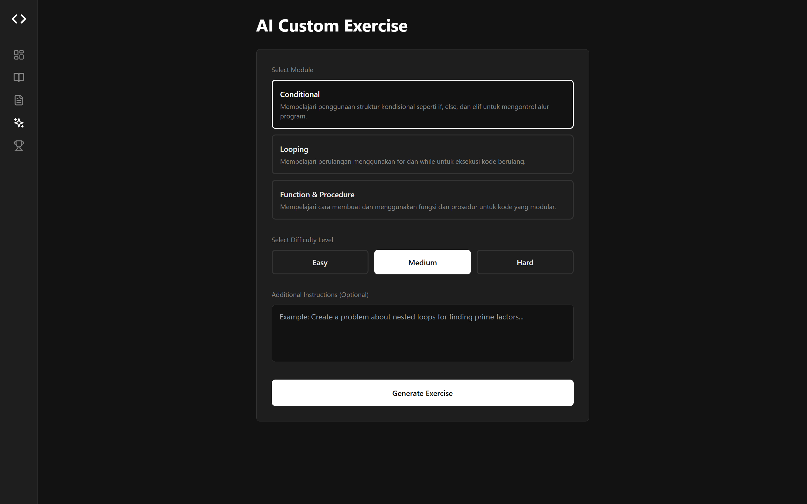
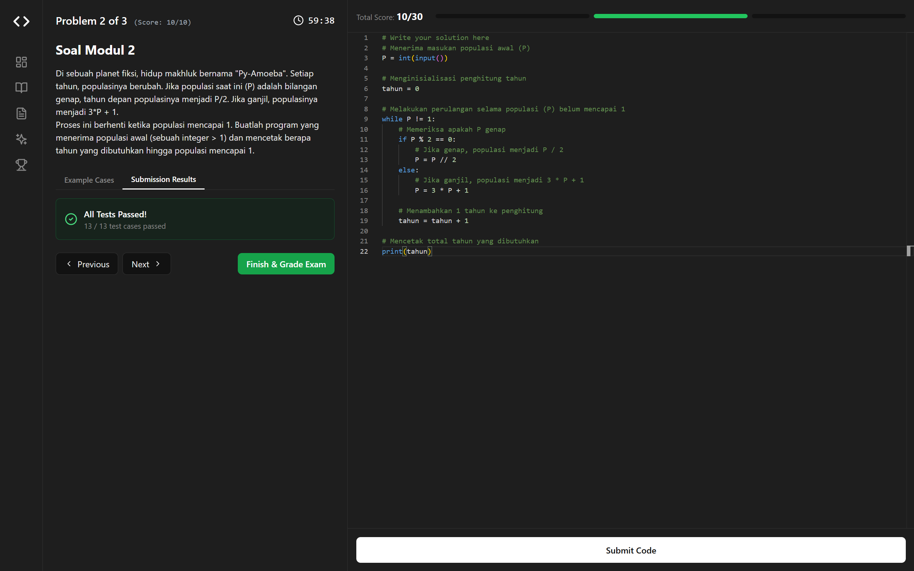
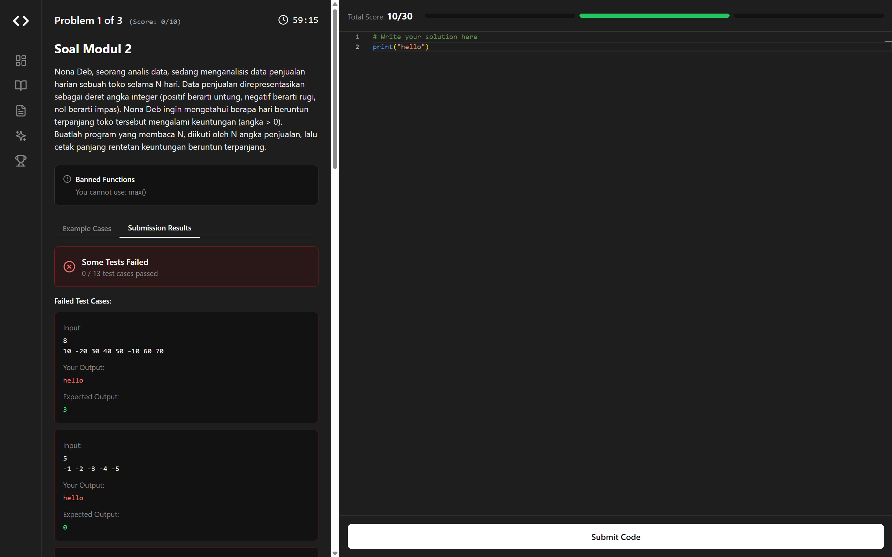
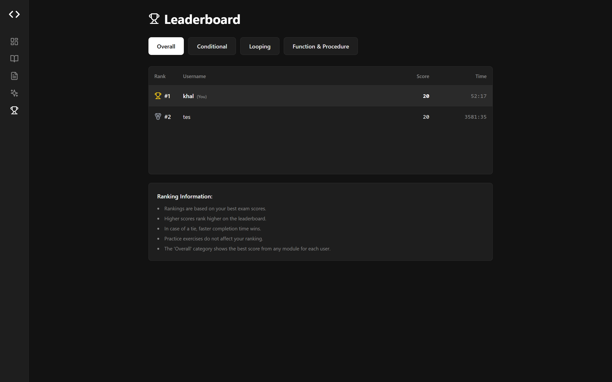

# Py1: Virtual Lab untuk Computational Thinking (CompThink)

<p align="center">
  
</p>

<p align="center">
  <strong>M Khalfani Shaquille Indrajaya</strong><br/>
  NIM: 18223104
</p>

---

## Deskripsi

Proyek ini adalah **Tugas Virtual Lab** untuk mata kuliah **II3140 Pengembangan Aplikasi Web dan Mobile** di Institut Teknologi Bandung (ITB).

**Py1** adalah sebuah platform pembelajaran online komprehensif yang dirancang untuk menjadi laboratorium virtual utama untuk mata kuliah Berpikir Komputasional bagi mahasiswa tingkat pertama (TPB) di ITB. Platform ini menyediakan lingkungan belajar yang interaktif, mandiri, dan menantang untuk mengasah kemampuan pemecahan masalah menggunakan bahasa pemrograman Python.

**Live Demo:** [**pyone.vercel.app**](https://pyone.vercel.app)

## Fitur Utama

-   **Modul Pembelajaran Interaktif:** Materi pembelajaran terstruktur yang mencakup konsep fundamental seperti Percabangan, Perulangan, dan Fungsi, dilengkapi dengan pelacakan progres yang terintegrasi.
-   **Ujian Formal:** Ujian berdurasi 60 menit untuk setiap modul dengan serangkaian soal yang telah ditentukan untuk menguji pemahaman mahasiswa secara formal. Sesi dapat dilanjutkan kembali, dan kode akan tersimpan secara otomatis saat waktu habis.
-   **Latihan Berbasis AI:** Mode latihan dinamis di mana mahasiswa dapat menghasilkan soal-soal unik tanpa batas dengan menentukan modul, tingkat kesulitan, dan instruksi opsional.
-   **Workspace Kode di Browser:** Editor kode modern (berbasis Monaco) dengan sistem umpan balik terperinci, yang menampilkan hasil untuk setiap *test case*, termasuk input, output Anda, dan output yang diharapkan untuk kasus yang gagal.
-   **Papan Peringkat Kompetitif:** Sistem peringkat berdasarkan skor ujian terbaik, dengan waktu penyelesaian yang lebih cepat sebagai penentu jika terjadi seri. Papan peringkat tersedia untuk setiap modul dan secara keseluruhan.
-   **Dashboard Personal:** Pusat kendali bagi mahasiswa untuk melacak progres belajar, melanjutkan sesi aktif (ujian atau latihan), dan melihat hasil ujian sebelumnya.

---

## Cuplikan Layar (Screenshots)

### Halaman Autentikasi (Login/Register)

Tampilan halaman login dan registrasi pengguna.

### Dashboard

Dashboard utama yang menampilkan ringkasan progres belajar dan sesi yang sedang berjalan.

### Daftar Modul Pembelajaran

Daftar modul pembelajaran yang tersedia, lengkap dengan progres masing-masing modul.

### Konten Modul Pembelajaran

Tampilan detail materi pembelajaran dalam sebuah modul.

### Daftar Ujian

Halaman yang menampilkan daftar ujian yang tersedia untuk setiap modul.

### Latihan AI Kustom

Halaman untuk mengonfigurasi dan membuat soal latihan berbasis AI.

### Workspace (Editor Kode)

Tampilan editor kode utama tempat pengguna menulis dan menguji solusi.

### Workspace (Hasil Submisi)

Tampilan hasil submisi kode, menunjukkan test case yang lolos dan gagal.

### Papan Peringkat

Halaman papan peringkat yang menampilkan skor terbaik pengguna.

---

## Techstack

| Kategori      | Teknologi                                                                                             |
| :------------ | :----------------------------------------------------------------------------------------------------- |
| **Frontend**  | [**React**](https://react.dev/) ([TypeScript](https://www.typescriptlang.org/)), [**Vite**](https://vitejs.dev/), [**Tailwind CSS**](https://tailwindcss.com/) |
| **Backend**   | [**Node.js**](https://nodejs.org/) ([TypeScript](https://www.typescriptlang.org/)), [**Express.js**](https://expressjs.com/) |
| **Database**  | [**MongoDB**](https://www.mongodb.com/) (dengan [Mongoose](https://mongoosejs.com/))                      |
| **Deployment**| **Frontend:** [Vercel](https://vercel.com/) <br/> **Backend:** [Docker](https://www.docker.com/) (Docker Compose) di Virtual Machine |
| **Pustaka Inti** | **Manajemen State:** [Zustand](https://github.com/pmndrs/zustand) <br/> **Klien API:** [Axios](https://axios-http.com/) <br/> **Editor Kode:** [Monaco Editor](https://microsoft.github.io/monaco-editor/) <br/> **Integrasi AI:** [Google Gemini API](https://ai.google.dev/) |

---

## Panduan Deployment

Proyek ini dibagi menjadi dua bagian utama: aplikasi frontend dan layanan backend.

### Deployment Frontend (Vercel)

Frontend dirancang untuk deployment yang mudah di platform Vercel.

**Prerequisites:**
- Akun Vercel (gratis).
- Kode proyek sudah berada di repositori Git (misalnya, GitHub).

**Langkah-langkah:**
1.  **Login ke Vercel** dan navigasi ke dashboard Anda.
2.  Klik **"Add New..." > "Project"** dan pilih repositori Git Anda.
3.  **Konfigurasi Proyek:**
    -   Vercel akan mendeteksi **Vite** sebagai framework secara otomatis.
    -   **Penting: Atur "Root Directory" menjadi `frontend`**.
4.  **Tambahkan Environment Variables:**
    -   Buka pengaturan proyek dan temukan bagian "Environment Variables".
    -   Tambahkan variabel baru:
        -   **Key:** `VITE_API_BASE_URL`
        -   **Value:** URL publik dari backend Anda yang telah di-deploy (contoh: `https://api-domain.com/api`).
5.  **Deploy:** Klik tombol "Deploy". Vercel akan menangani proses build dan deployment, lalu memberikan Anda URL publik setelah selesai.

### Deployment Backend (VM dengan Docker)

Backend, database, dan reverse proxy di-containerize menggunakan Docker dan diorkestrasi dengan Docker Compose.

**Prasyarat:**
1.  Sebuah Virtual Machine (VM) yang menjalankan distribusi Linux (misalnya, Ubuntu 22.04).
2.  Docker dan Docker Compose terinstal di VM.
3.  Nama domain yang diarahkan ke alamat IP publik VM.
4.  Akses SSH ke VM.

**Langkah-langkah:**

1.  **Clone Repositori di VM:**
    ```bash
    git clone <url-repositori-anda>
    cd <folder-proyek>/backend
    ```

2.  **Buat File Environment:**
    -   Salin file contoh: `cp .env.example .env`
    -   Edit file `.env` dan isi semua nilai yang diperlukan, seperti `DB_URI`, `JWT_SECRET`, dan `GEMINI_API_KEY`.

3.  **Deployment Awal (HTTP) untuk verifikasi:**
    -   Langkah ini memastikan semua layanan dapat berkomunikasi sebelum mengaktifkan SSL.
    ```bash
    docker-compose -f docker-compose.http.yml up -d --build
    ```
    -   Verifikasi dengan mengakses `http://<ip-vm-anda>:8080`. Anda akan melihat pesan selamat datang dari backend.
    -   Setelah terverifikasi, matikan layanan HTTP:
        ```bash
        docker-compose -f docker-compose.http.yml down
        ```

4.  **Deployment HTTPS dengan Let's Encrypt:**
    -   **Konfigurasi Domain:**
        -   Edit `backend/nginx/init-letsencrypt.sh` dan atur variabel `domains` dan `email` Anda.
        -   Edit `backend/nginx/default.https.conf` dan ganti domain placeholder dengan domain Anda.
    -   **Jalankan Skrip Inisialisasi SSL:**
        ```bash
        chmod +x ./nginx/init-letsencrypt.sh
        sudo ./nginx/init-letsencrypt.sh
        ```
        Skrip ini akan mendapatkan sertifikat SSL dari Let's Encrypt.
    -   **Jalankan Layanan Produksi:**
        ```bash
        docker-compose -f docker-compose.https.yml up -d --build
        ```

5.  **Verifikasi Akhir:** Akses backend Anda melalui `https://<domain.com>`. API sekarang seharusnya berjalan dan aman dengan HTTPS.

### Seeding Database

Untuk mengisi database dengan soal-soal ujian awal, jalankan skrip seed secara manual.

1.  Pastikan container Docker berjalan.
2.  Dari direktori `backend`, jalankan:
    ```bash
    docker-compose -f docker-compose.https.yml run --rm backend npm run seed
    ```